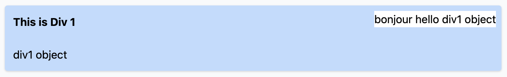
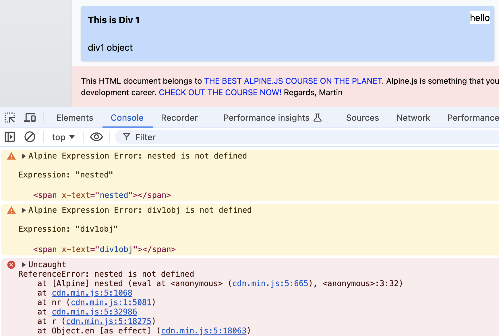
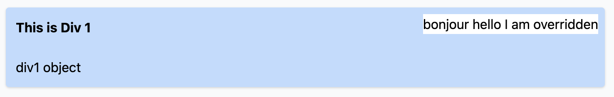
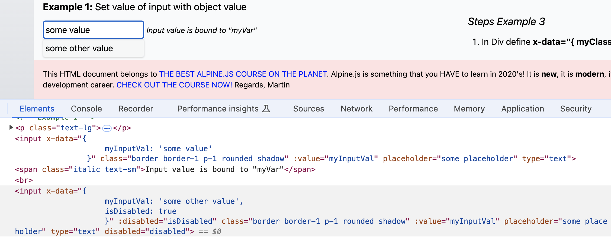
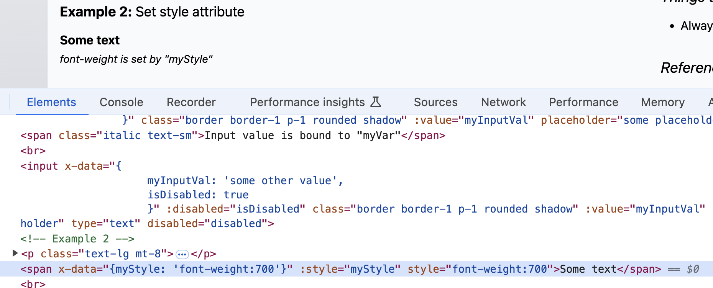
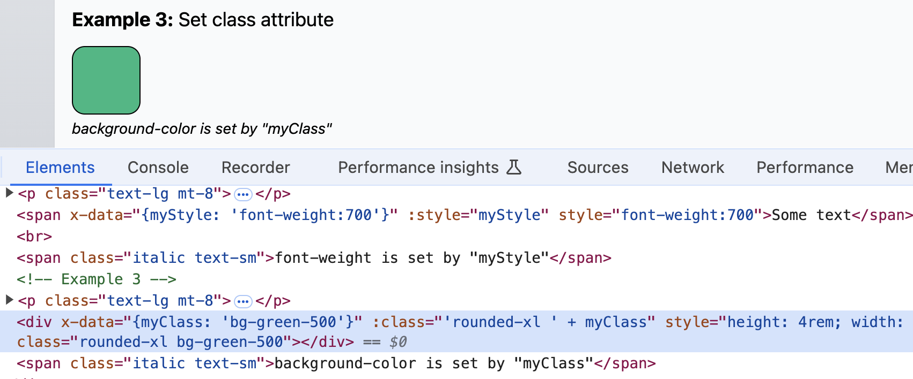

# Alpine JS Course Part 1

## Contents
1. [Object Scope](#object-scope)
2. [`x-data` and `x-text`](#x-data-and-x-text)
3. [`x-bind`](#x-bind)
4. [`x-model`](#x-model)
5. [`x-show` and `x-if`](#x-show-and-x-if)
6. [`x-on`, `x-ref`, `$refs`](#x-on-x-ref-and-refs)

### Object Scope

Like other situations, parent elements encapsulate defined attributes and descendants inherit them. Sibling elements that have a defined value for an `x-data` attribute do not share scopes, so they could be defined with identical ones.

***

### x-data and x-text

https://alpinejs.dev/directives/data  
https://alpinejs.dev/directives/text

If a parent element contains an `x-data` attribute and also has an `x-text` attribute defined that carries that `x-data` attribute, then child elements will not be able to display the value of `x-data` using the `x-text` attribute. It will break and say in the console that the value for the `span`'s `x-text` is not defined.

It is valid for the parent element to have both attributes, but a child element also containing an `x-text` attribute will error.

This works:

```html
<div x-data="{div1obj: 'div1 object'}" class="bg-blue-200 w-144 relative p-3 mb-6 rounded shadow">
    <b>This is Div 1</b><br><br>
    <span x-text="div1obj"></span>
    <br>
    <div x-data="{nested: 'hello'}" class="bg-white absolute top-2 right-2">
        bonjour
        <span x-text="nested"></span>
        <span x-text="div1obj"></span>
    </div>
</div>
```



This does not, as the first nested `div` has an `x-text` defined and its children elements also have an `x-text` defined:

```html
<div x-data="{div1obj: 'div1 object'}" class="bg-blue-200 w-144 relative p-3 mb-6 rounded shadow">
    <b>This is Div 1</b><br><br>
    <span x-text="div1obj"></span>
    <br>
    <div x-data="{nested: 'hello'}" x-text="nested" class="bg-white absolute top-2 right-2">
        bonjour
        <span x-text="nested"></span>
        <span x-text="div1obj"></span>
    </div>
</div>
```



You can also override `x-data` attributes with a child element:

```html
<div x-data="{div1obj: 'div1 object'}" class="bg-blue-200 w-144 relative p-3 mb-6 rounded shadow">
    <b>This is Div 1</b><br><br>
    <span x-text="div1obj"></span>
    <br>
    <div x-data="{nested: 'hello', div1obj: 'I am overridden'}" 
        class="bg-white absolute top-2 right-2">
        bonjour
        <span x-text="nested"></span>
        <span x-text="div1obj"></span>
    </div>
</div>
```



***

### x-bind

https://alpinejs.dev/directives/bind

X-bind doesn't need to have `x-bind` on an element, such as `x-bind:value="xyz"`. It can just be `:value="xyz"`.

You can also manipulate attributes by using binding, such as classes or disabling.

As you can see, adding a key in the second `input`'s `x-data` as `isDisabled`, setting to `true`, and then adding an `x-bind` to the `input`'s `disabled` attribute set to `isDisabled` can dynamically update the value set.

```html
<input x-data="{ myInputVal: 'some value' }"
    class="border border-1 p-1 rounded shadow" 
    :value="myInputVal" placeholder="some placeholder" type="text">

<input x-data="{
    myInputVal: 'some other value',
    isDisabled: true
    }" 
    :disabled="isDisabled"
    class="border border-1 p-1 rounded shadow" 
    :value="myInputVal" placeholder="some placeholder" type="text">
```



You can add or append styles and classes to an element using `x-bind`.

```html
<span x-data="{myStyle: 'font-weight:700'}" :style="myStyle">Some text</span>
```



If you want to preserve an existing style or class and then append to it, you can use concatenation. If a `class` exists separately from `:class`, then they will be combined, with the `class` values placed first.

```html
 <div x-data="{myClass: 'bg-green-500'}" 
    :class="'rounded-xl ' + myClass"
    style="height: 4rem; width: 4rem; border: 1px solid black;">
</div>
```

Be careful; for things like styles and classes, enclose the pre-existing values in a single quote and then separate the adjacent value with a space before concatenating the data you are binding to.



***

### x-model

https://alpinejs.dev/directives/model

In x-model, the value of elements and objects influence each other - this is two way binding.

In this first example, I set up my initial value with `x-data` on the encasing `section` element with a key of `myInput`, which here is a blank value. I make the `input` carry the `x-model` of this value, which will be affected by whatever I add into the `input` field.

I then add an `x-text` attribute onto the adjacent `span` element that will dynamically update its value based on what the value of `x-model` is.

```html
<section x-data="{ myInput: '' }">
    <input x-model="myInput" class="border border-1 p-1 rounded shadow" type="text">
    <span x-text="'Output: ' + myInput">Output: </span>
</section>
```

<video width='600' height='300' controls>
    <source src="../vid/x-model1.mov" type="video/mp4">
</video>


In the next example, I made two inputs be affected by each other. Similar to the previous example, I create an initial key/value pair on the encasing `section` as `myValue : 'Hello'`. I place an `x-model` on both adjacent `input`s as they will both be influencing each other's value. I then bind them both with the initial value of `myValue`. As I update one input, the other will match each other's value.

```html
<section x-data="{ myValue: 'Hello' }">
    <input x-model="myValue" :value="myValue" class="border border-1 p-1 rounded shadow" type="text">
    <input x-model="myValue" :value="myValue" class="border border-1 p-1 rounded shadow" type="text">
</section>
```
<video width='600' height='200' controls>
    <source src="../vid/x-model2.mov" type="video/mp4">
</video>


In the last example, I made a `div` and a `select` list have their background color (here determined by class) affected by whatever a selected option's value is. Since the `select` originally had a long string of classes, for readability, I moved them into another key/val pair inside of the `x-data` so that I can concatenate them to the class that influences its background color. Since I am setting the classes with a key from `x-data`, I use `x-bind` to tie them together. 

Recall that the value of `select` is whatever `option` is chosen, so that value carries into the `x-model` that is set on the `select`. That value passing into `myColor` influences the background color of both the `div` and the `select`.

Note that the `option` tags don't necessarily need to have a `value` attribute unless I want to override whatever may be set within the nodes themselves, hence the first `option` still carrying the `value` of gray.

```html
<section x-data="{ 
        myColor: 'gray', 
        selectClasses: ' h-full p-2 rounded ml-3 border border-gray-900 text-white focus:outline-none'
    }" 
    class="flex">
    <div :class="'bg-' + myColor + '-600'" style="height: 5rem; width: 5rem; border: 1px solid #555;"></div>
    <select x-model="myColor" :class="'bg-' + myColor + '-600' + selectClasses">
        <option value="gray">Select color</option>
        <option>green</option>
        <option>blue</option>
        <option>red</option>
    </select>
</section>
```

<video width='600' height='300' controls>
    <source src="../vid/x-model3.mov" type="video/mp4">
</video>

***

### x-show and x-if

https://alpinejs.dev/directives/show  
https://alpinejs.dev/directives/if

You can toggle values using event handlers. Handlers are preceded with an `@` sign. You can then use negation to toggle a `true` or `false` value when clicking, for example. 

You can also use ternary operations to toggle values of things like `x-text` and binding classes based on the value of the data's key, for example.

As the names imply, `x-show` uses a boolean value to determine if an element is visible by setting the `display` style attribute. `X-if` uses a boolean value to include the element in the DOM if truthy, and requires a `template` surrounding the element in question.

In the first example, the text in the `span` displays if the value of `showText` is true, and hides if not. It is not gone from the DOM, it just has a style attribute of `display: none;`. `showText` toggles based on the user clicking the button. This value also affects the style `:class` and the content (`x-text`) of the button by using ternary operators.

```html
<section x-data="{ 
    showText: false,
    buttonClass: ' transition p-1 rounded shadow focus:outline-none'
    }">
    <button @click="showText = !showText" 
    x-text="showText ? 'Hide' : 'Show'" 
    :class="showText ? 'bg-red-300 hover:bg-red-400' + buttonClass : 'bg-green-300 hover:bg-green-400' + buttonClass">Show</button>
    <span x-show="showText" class="bg-gray-200 ml-3 p-2">I am supposed to be seen only when <b>show == true</b>.</span>
</section>
```

<video width='500' height='200' controls>
    <source src="../vid/x-show.mov" type="video/mp4">
</video>

In the second example, the idea is essentially the same, except for this a `template` tag is needed to surround the element that I want to add or remove from the DOM. 

```html
<section x-data="{ 
    showText: false,
    buttonClass: ' transition p-1 rounded shadow focus:outline-none'
    }">
    <button @click="showText = !showText" 
    x-text="showText ? 'Hide' : 'Show'" 
    :class="showText ? 'bg-red-300 hover:bg-red-400' + buttonClass : 'bg-green-300 hover:bg-green-400' + buttonClass">Show</button>
    <template x-if="showText">
        <span class="bg-gray-200 ml-3 p-2">Hi! When I am gone, you won't find me in the DOM! ;-)</span>
    </template>
</section>
```

<video width='500' height='300' controls>
    <source src="../vid/x-if.mov" type="video/mp4">
</video>

***

### x-on, x-ref, and $refs

`X-on` is effectively an event handler. Recall in JavaScript, there are old event calls such as `onClick`, `onSubmit`, `onLoad`, etc. Instead of affixing `x-on` as an attribute, you can use `@` as a shorthand.

You can reset values using `x-on`. Similar to the first `x-model` exercise, we set an initial value to the key in the `x-data` object. I then model it on the `input`. I set the text of the output `span`, and then add a handler on the adjacent button that resets the input to an empty string.

```html
<section x-data="{ myInput: '' }">
    <input x-model="myInput" class="border border-1 p-1 rounded shadow" type="text">
    <span x-text="'Output: ' + myInput"></span>
    <span @click="myInput = ''" class="ml-2 bg-blue-200 p-2 rounded border border-1 cursor-pointer">Reset</span>
</section>
```

<video width='500' height='300' controls>
    <source src="../vid/x-on-reset.mov" type="video/mp4">
</video>

You can toggle the display and behavior of elements based on events. In this second example, I set an inital value of `false` on the `x-data` object key `isOpen`. I set it on the `div` acting as a button. When I hover over this "button", `isOpen` becomes `true`; when this happens, the adjacent submenu `div` that `x-show`s on this value also becomes visible. When I `@click.outside` that button `div`, then `isOpen` becomes false, hiding the submenu.

```html
<section x-data="{ isOpen: false }" class="relative">
    <div id="button" @mouseenter="isOpen = true" @click.outside="isOpen = false" class="bg-blue-200 hover:bg-blue-300 inline-block px-2 py-1 cursor-pointer">Open Menu</div>
    <div x-show="isOpen" class="mt-2" id="submenu">
        <a target="_blank" class="px-2 py-1 inline-block w-32 cursor-pointer bg-blue-200 hover:bg-blue-300" href="https://www.google.com">Google</a><br>
        <a target="_blank" class="px-2 py-1 inline-block w-32 cursor-pointer bg-blue-200 hover:bg-blue-300" href="https://www.amazon.com">Amazon</a><br>
    </div>
</section>
```

<video width='500' height='300' controls>
    <source src="../vid/x-on-x-show-menu.mov" type="video/mp4">
</video>

I can pull in values on elements using `x-ref` with `$refs`. Perhaps you can think of them as user-defined JS object variables, since you call properties and methods attributed to whatever kind of element is being `x-ref`'d. This can be useful when trying to adhere to a constraint.

In this example, I create a key `remainingChars` and set it to the `maxlength` of 10 as indicated on the `input`. I want the adjacent descriptive `span` to display how many remaining characters I have allowed as I fill in the `input`. Since I interact with an `input` by typing, I can use the `@keyup` event handler to regenerate the new value of the `remainingChars` each time. I set an `x-ref` name on the `input` to whatever I want (`username` here), and use this reference to dynamically update the subtracted value set to the remaining characters. I call this reference by `$refs.username.value.length`, which returns a number I can subtract from the max length of 10. Because the `input` already had the `maxlength` of 10 set, I cannot input more than ten characters, so the `remainingChars` won't become negative.

```html
<section x-data="{ remainingChars: 10 }">
    <input @keyup="remainingChars = 10 - $refs.username.value.length" 
    x-ref="username"
    placeholder="Enter Username (max. 10 Char)" 
    class="border border-1 p-1 w-60 rounded shadow" maxlength="10" type="text">
    <br>
    <span x-text="'Remaining characters: ' + remainingChars"></span>
</section>
```

<video width='500' height='300' controls>
    <source src="../vid/x-on-x-ref.mov" type="video/mp4">
</video>

***

**Extra info for `x-on`**
- You can chain other modifiers to `x-on` event listeners, such as `@keyup.shift.enter` to check if the Enter key was pressed only if the Shift key is first held down.
- You can create custom events and dispatch them with event listeners.
```html
<div x-data @foo="alert('Button Was Clicked!')">
    <button @click="$dispatch('foo')">...</button>
</div>
```

Further reading: https://alpinejs.dev/directives/on